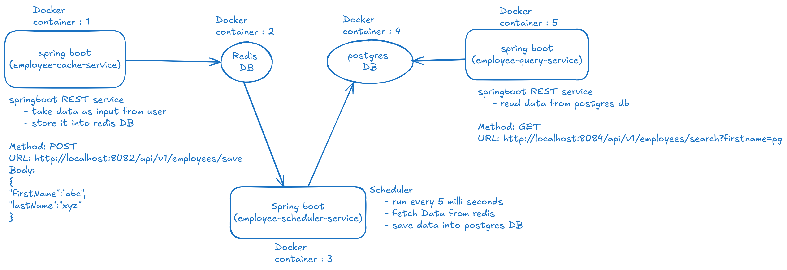

**Application Architecture**


**Instructions to run application**
* docker and docker-compose must installed in the system.
* Download this repository
* Go to the downloaded repository directory inside your system
* Use the below command to start the application
  ```shell
    docker-compose up
  ``` 

**Docker Commands**
* Command to run postrges db
  ```shell
  docker run --name <container-name> -e POSTGRES_DB=<db-name> -e POSTGRES_USER=<db-username> -e POSTGRES_PASSWORD=<db-password> postgres
  e.g. : docker run --name postgres -e POSTGRES_DB=pgdb -e POSTGRES_USER=pgoel -e POSTGRES_PASSWORD=89910331 postgres
  ```

* Command to open postgres server and its terminal
    ```shell
      docker exec -it <container-id> bash
      psql -U <db-username> -d <db-name>
    ```

* Command to run redis
  ```shell
    docker run redis
  ```

* Command to open redis server and its terminal
  ```shell
      docker exec -it <container-id> bash
      redis-cli
  ```
  
**Useful Urls**
* https://docs.spring.io/spring-data/jpa/reference/jpa/query-methods.html
